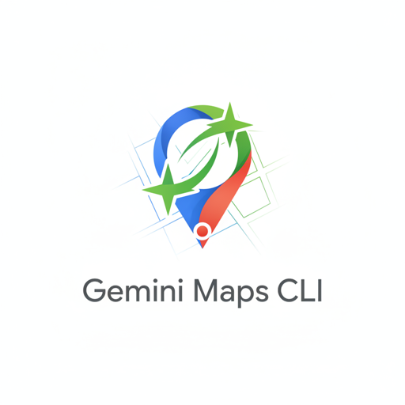

# gemini-google-maps-tool

<p align="center">
  
</p>

[](https://www.python.org/downloads/)
[](https://opensource.org/licenses/MIT)
[](https://github.com/astral-sh/ruff)
[](https://github.com/python/mypy)
[](https://www.anthropic.com/claude)
[](https://www.anthropic.com/claude)
[](https://www.anthropic.com/claude/code)

A production-ready CLI and Python library for querying Gemini with Google Maps grounding, connecting the model to accurate, up-to-date Google Maps data.

## Quick Start

```bash
# Install
uv tool install gemini-google-maps-tool

# Set API key
export GEMINI_API_KEY="your-api-key"

# Basic query
gemini-google-maps-tool query "Best coffee shops in Amsterdam"

# Query with location
gemini-google-maps-tool query "Italian restaurants nearby" \
  --lat-lon "52.37,4.89"

# Verbose mode (progressive logging)
gemini-google-maps-tool query "Sushi restaurants" -v    # INFO
gemini-google-maps-tool query "Hotels" -vv              # DEBUG
gemini-google-maps-tool query "Museums" -vvv            # TRACE

# Markdown output with sources
gemini-google-maps-tool query "Best museums in Paris" --text

# Shell completion
eval "$(gemini-google-maps-tool completion bash)"  # or zsh/fish

# Get help
gemini-google-maps-tool --help
```

## Table of Contents

- [Quick Start](#quick-start)
- [About](#about)
  - [What is Google Maps Grounding?](#what-is-google-maps-grounding)
  - [Why CLI-First Design?](#why-cli-first-design)
- [Use Cases](#use-cases)
- [Features](#features)
- [Installation](#installation)
- [Configuration](#configuration)
  - [API Key Setup](#api-key-setup)
  - [Shell Completion](#shell-completion)
- [Claude Code Plugin](#claude-code-plugin)
- [Usage](#usage)
  - [CLI Usage](#cli-usage)
  - [Library Usage](#library-usage)
- [CLI Command Reference](#cli-command-reference)
- [Architecture](#architecture)
- [Development](#development)
- [Testing](#testing)
- [Resources](#resources)
- [Contributing](#contributing)
- [License](#license)

## About

### What is Google Maps Grounding?

**Google Maps grounding** connects Gemini to Google Maps' extensive database of **over 250 million places worldwide**, enabling:

- **Location-aware responses** with accurate, up-to-date information about businesses, restaurants, and attractions
- **Personalized recommendations** tailored to specific geographical areas
- **Automatic citation generation** with structured sources (titles, URIs, place IDs)
- **Seamless integration** via Gemini's `generateContent` endpoint—no additional infrastructure needed

Learn more: [Gemini API - Google Maps Grounding Documentation](https://ai.google.dev/gemini-api/docs/maps-grounding)

### Why CLI-First Design?

This tool prioritizes **agent-friendly architecture** and **composability**, making it ideal for:

- **🤖 AI Agents (Claude Code, etc.)**: Structured commands and informative error messages enable effective ReAct loops (Reason + Act)
- **🔧 Automation Pipelines**: JSON output to stdout and logs to stderr allow seamless piping and integration
- **🧩 Reusable Building Blocks**: Commands serve as building blocks for skills, MCP servers, shell scripts, and custom workflows
- **🎯 Dual-Mode Operation**: Use as both a CLI tool and importable Python library
- **✅ Production Quality**: Type-safe (strict mypy), comprehensive testing (pytest), and robust error handling

## Use Cases

- 📍 **Location-Based Queries**: Find businesses, restaurants, and services near specific locations
- 🗺️ **Itinerary Planning**: Generate multi-day plans with directions and place recommendations
- 🔍 **Place-Specific Information**: Get details about specific locations, hours, reviews, and amenities
- 📊 **Data Analysis**: Integrate location-aware data into analytics and research workflows
- 🏗️ **RAG Applications**: Build retrieval-augmented generation systems with accurate geographical context
- 🌐 **Location Services**: Power travel, retail, or food delivery applications with Google Maps data

## Features

- ✅ **Single Command Interface**: Simple `query` command handles all query types
- ✅ **Location Context**: Optional lat/lon coordinates for personalized results
- ✅ **Model Selection**: Choose between `flash` (gemini-2.5-flash) or `flash-lite` (default)
- ✅ **Multi-Level Verbosity**: Progressive logging with `-v`, `-vv`, `-vvv` flags for debugging
- ✅ **Shell Completion**: Tab-completion for Bash, Zsh, and Fish shells
- ✅ **Flexible Output**: JSON (default) or markdown text (`--text`) with automatic source citations
- ✅ **Verbose Mode**: Include full grounding metadata with sources and citations
- ✅ **Stdin Support**: Read queries from stdin for composability with other tools
- ✅ **Structured Output**: JSON to stdout, logs to stderr for easy parsing and piping
- ✅ **Type-Safe**: Strict mypy checking with comprehensive type hints
- ✅ **Importable Library**: Use programmatically in Python applications
- ✅ **Production Quality**: Comprehensive testing, linting (ruff), and error handling

## Installation

### Prerequisites

- **Python 3.14+**
- **[uv](https://github.com/astral-sh/uv)** package manager
- **Gemini API Key** (get yours at [Google AI Studio](https://aistudio.google.com/app/apikey))

### Global Installation with uv (Recommended)

```bash
# Install globally with uv tool
uv tool install gemini-google-maps-tool

# Verify installation
gemini-google-maps-tool --version
```

### Install from Source

```bash
# Clone the repository
git clone https://github.com/dnvriend/gemini-google-maps-tool.git
cd gemini-google-maps-tool

# Install globally with uv
uv tool install .
```

### Install with mise (Development)

```bash
cd gemini-google-maps-tool
mise trust
mise install
uv sync
uv tool install .
```

## Configuration

### API Key Setup

**Store your Gemini API key securely** using one of these methods:

#### macOS Keychain (Recommended)

```bash
# Store API key in macOS keychain
security add-generic-password \\
  -a "production" \\
  -s "GEMINI_API_KEY" \\
  -w "your-api-key-here"

# Retrieve and export for CLI use
export GEMINI_API_KEY=$(security find-generic-password \\
  -a "production" \\
  -s "GEMINI_API_KEY" \\
  -w)
```

#### Environment Variable

```bash
# Export directly (less secure, session-only)
export GEMINI_API_KEY='your-api-key-here'

# Or add to your shell profile (~/.zshrc, ~/.bashrc)
echo 'export GEMINI_API_KEY="your-api-key-here"' >> ~/.zshrc
source ~/.zshrc
```

### Get Your API Key

1. Visit [Google AI Studio](https://aistudio.google.com/app/apikey)
2. Sign in with your Google account
3. Click "Create API Key"
4. Copy and store securely using one of the methods above

### Pricing

- **Google Maps Grounding**: $25 per 1,000 grounded prompts
- **Free Tier**: Up to 500 requests per day
- Monitor usage: [Google Cloud Console](https://console.cloud.google.com/)

Learn more: [Gemini API Pricing](https://ai.google.dev/pricing)

### Shell Completion

Enable tab-completion for gemini-google-maps-tool commands, options, and arguments.

#### Bash

```bash
# Quick installation (temporary - current session only)
eval "$(gemini-google-maps-tool completion bash)"

# Persistent installation (add to ~/.bashrc)
echo 'eval "$(gemini-google-maps-tool completion bash)"' >> ~/.bashrc
source ~/.bashrc

# File-based installation (better performance)
gemini-google-maps-tool completion bash > ~/.gemini-google-maps-tool-complete.bash
echo 'source ~/.gemini-google-maps-tool-complete.bash' >> ~/.bashrc
source ~/.bashrc
```

**Requirements:** Bash 4.4 or later

#### Zsh

```bash
# Quick installation (temporary - current session only)
eval "$(gemini-google-maps-tool completion zsh)"

# Persistent installation (add to ~/.zshrc)
echo 'eval "$(gemini-google-maps-tool completion zsh)"' >> ~/.zshrc
source ~/.zshrc

# File-based installation (better performance)
gemini-google-maps-tool completion zsh > ~/.gemini-google-maps-tool-complete.zsh
echo 'source ~/.gemini-google-maps-tool-complete.zsh' >> ~/.zshrc
source ~/.zshrc
```

#### Fish

```bash
# Install to Fish completions directory (auto-loaded)
gemini-google-maps-tool completion fish > ~/.config/fish/completions/gemini-google-maps-tool.fish

# Reload completions (or restart Fish)
fish_update_completions
```

**Note:** Fish automatically loads completions from `~/.config/fish/completions/`, no additional configuration needed.

#### Verify Installation

After installing completion, test it works:

```bash
# Type this and press TAB to see available commands
gemini-google-maps-tool <TAB>

# Type this and press TAB to see available options
gemini-google-maps-tool query --<TAB>
```

## Claude Code Plugin

This repository includes a Claude Code marketplace plugin for seamless integration with Claude Code IDE.

### Available Commands

**Slash Commands** (quick reference):
- `/gemini-google-maps-tool:query` - Query Gemini with Google Maps grounding
- `/gemini-google-maps-tool:completion` - Generate shell completion scripts

**Skill** (comprehensive guide):
- `/skill-gemini-google-maps-tool` - Complete documentation with progressive disclosure

### Usage in Claude Code

```
# Quick query
/gemini-google-maps-tool:query "Best restaurants in Tokyo"

# Get comprehensive help
/skill-gemini-google-maps-tool

# Or use natural language
Use the skill-gemini-google-maps-tool to help me query places
```

### Plugin Features

- 📚 **Progressive Disclosure**: Comprehensive documentation in collapsible sections
- 🎯 **Focused Commands**: Quick syntax reference for common operations
- 🔍 **Troubleshooting Guide**: Common issues and solutions
- 📖 **Examples Library**: Real-world usage patterns
- 🐍 **Python Library Integration**: Code examples for programmatic use

The plugin is automatically available when you open this repository in Claude Code.

## Usage

### CLI Usage

#### Basic Query

```bash
gemini-google-maps-tool query "Best coffee shops near me"
```

**Output:**
```json
{
  "response_text": "Here are some excellent coffee shops..."
}
```

#### Query with Location Context

Provide location coordinates for personalized, location-aware results:

```bash
gemini-google-maps-tool query "Italian restaurants nearby" \\
  --lat-lon "37.78193,-122.40476"
```

**Location Format**: `lat,lon` (e.g., `37.78193,-122.40476`)

#### Verbose Mode (with Grounding Metadata)

Include full grounding sources, citations, and widget tokens:

```bash
gemini-google-maps-tool query "Museums in San Francisco" \\
  --lat-lon "37.7749,-122.4194" \\
  --verbose
```

**Output includes grounding metadata:**
```json
{
  "response_text": "...",
  "grounding_metadata": {
    "grounding_chunks": [
      {
        "title": "San Francisco Museum of Modern Art",
        "uri": "https://maps.google.com/?cid=...",
        "place_id": "places/ChIJ..."
      }
    ],
    "grounding_supports": [
      {
        "segment": {
          "start_index": 0,
          "end_index": 85,
          "text": "..."
        },
        "grounding_chunk_indices": [0]
      }
    ],
    "google_maps_widget_context_token": "widgetcontent/..."
  }
}
```

#### Model Selection

Choose between models based on your needs:

```bash
# Use gemini-2.5-flash (more powerful, higher cost)
gemini-google-maps-tool query "Plan a day in NYC" --model flash

# Use gemini-2.5-flash-lite (default, faster, lower cost)
gemini-google-maps-tool query "Best pizza places" --model flash-lite
```

#### Text Output (Markdown)

Output human-readable markdown text instead of JSON:

```bash
# Basic text output with sources
gemini-google-maps-tool query "Best museums in Amsterdam" --text
```

**Output:**
```markdown
Here are some of the best museums in Amsterdam:

The Rijksmuseum features Dutch Golden Age masterpieces...

---

## Sources

1. [Rijksmuseum](https://maps.google.com/?cid=...)
2. [Van Gogh Museum](https://maps.google.com/?cid=...)
3. [Anne Frank House](https://maps.google.com/?cid=...)
```

The `--text` (or `-t`) flag automatically includes sources as clickable markdown links, making it perfect for:
- Human-readable output
- Documentation and reports
- Piping to markdown renderers
- Copy-paste friendly results

#### Reading from Stdin

Compose with other commands using stdin:

```bash
# Direct pipe
echo "Best sushi restaurants near Times Square" | \\
  gemini-google-maps-tool query --stdin \\
  --lat-lon "40.758,-73.9855"

# From file
cat query.txt | gemini-google-maps-tool query --stdin

# With other tools
curl -s https://example.com/location-query.txt | \\
  gemini-google-maps-tool query --stdin --verbose
```

#### Help

```bash
# Show main help
gemini-google-maps-tool --help

# Show query command help
gemini-google-maps-tool query --help
```

### Library Usage

Import and use programmatically in Python applications:

#### Basic Query

```python
from gemini_google_maps_tool import get_client, query_maps

# Initialize client
client = get_client()

# Execute query
result = query_maps(
    client=client,
    query="Best coffee shops near me",
)

print(result.response_text)
```

#### Query with Location and Grounding

```python
from gemini_google_maps_tool import get_client, query_maps

client = get_client()

result = query_maps(
    client=client,
    query="Italian restaurants nearby",
    lat_lon=(37.78193, -122.40476),  # San Francisco
    model="gemini-2.5-flash",
    include_grounding=True,
)

print(result.response_text)

# Access grounding metadata
if result.grounding_metadata:
    for chunk in result.grounding_metadata.grounding_chunks:
        print(f"Source: {chunk.title} - {chunk.uri}")
```

#### Parse Location Coordinates

```python
from gemini_google_maps_tool import parse_lat_lon

# Parse lat,lon string
lat, lon = parse_lat_lon("37.78193,-122.40476")
print(f"Latitude: {lat}, Longitude: {lon}")
```

#### Error Handling

```python
from gemini_google_maps_tool import get_client, query_maps, ClientError, QueryError

try:
    client = get_client()
    result = query_maps(client, "Best restaurants near me")
    print(result.response_text)
except ClientError as e:
    print(f"Client initialization failed: {e}")
except QueryError as e:
    print(f"Query failed: {e}")
```

## CLI Command Reference

### Main Command

```bash
gemini-google-maps-tool [OPTIONS] COMMAND [ARGS]...
```

**Options:**
- `--version` - Show version and exit
- `--help` - Show help message

### Query Command

```bash
gemini-google-maps-tool query [QUERY_TEXT] [OPTIONS]
```

**Arguments:**
- `QUERY_TEXT` - The query to send to Gemini (optional if using `--stdin`)

**Options:**

| Option | Short | Description | Default |
|--------|-------|-------------|---------|
| `--lat-lon LAT,LON` | | Location coordinates (e.g., `52.37,4.89`) | None |
| `--verbose` | `-v` | Include full grounding metadata | False |
| `--model MODEL` | | Model: `flash` or `flash-lite` | `flash-lite` |
| `--stdin` | `-s` | Read query from stdin | False |
| `--text` | `-t` | Output markdown instead of JSON | False |
| `--help` | | Show command help | |

**Output Formats:**

| Format | Flag | Structure |
|--------|------|-----------|
| JSON | (default) | `{"response_text": "...", "grounding_metadata": {...}}` |
| Markdown | `--text` | Response text + Sources section with links |

**Environment Variables:**
- `GEMINI_API_KEY` - Required API key (get from [Google AI Studio](https://aistudio.google.com/app/apikey))

## Architecture

This project follows a **modular, separation-of-concerns architecture**:

```
gemini_google_maps_tool/
├── __init__.py              # Public API exports for library usage
├── cli.py                   # CLI entry point (Click group)
├── core/                    # Core library functions (importable)
│   ├── __init__.py
│   ├── client.py           # Client/connection management
│   └── maps.py             # Google Maps grounding operations
├── commands/                # CLI command implementations
│   ├── __init__.py
│   └── query_commands.py   # CLI wrappers with Click decorators
└── utils.py                 # Shared utilities (logging, output)
```

### Key Design Principles

- **Separation of Concerns**: Core library functions (`core/`) are independent of CLI
- **Exception-Based Errors**: Core functions raise exceptions, CLI handles formatting/exit codes
- **Importable Library**: Expose public API via `__init__.py` for programmatic use
- **Type Safety**: Comprehensive type hints, strict mypy checks
- **Composability**: JSON to stdout, logs to stderr for piping and automation
- **Agent-Friendly**: Rich error messages enable AI agents (Claude Code) to self-correct in ReAct loops

## Development

### Setup Development Environment

```bash
# Clone repository
git clone https://github.com/dnvriend/gemini-google-maps-tool.git
cd gemini-google-maps-tool

# Install dependencies
make install

# Show available commands
make help
```

### Available Make Commands

```bash
make install          # Install dependencies
make format           # Format code with ruff
make lint             # Run linting with ruff
make typecheck        # Run type checking with mypy
make test             # Run tests with pytest
make check            # Run all checks (lint, typecheck, test)
make pipeline         # Full pipeline (format, check, build, install-global)
make build            # Build package
make run ARGS="..."   # Run locally with arguments
make clean            # Remove build artifacts
```

### Code Standards

- **Python 3.14+** with modern syntax (`dict`/`list` over `Dict`/`List`)
- **Type hints** for all functions (strict mypy)
- **Docstrings** for all public functions (Args, Returns, Raises)
- **Line length**: 100 characters
- **Formatting**: ruff
- **Linting**: ruff
- **Testing**: pytest

## Testing

Run the test suite:

```bash
# Run all tests
make test

# Run with verbose output
uv run pytest tests/ -v

# Run specific test file
uv run pytest tests/test_utils.py

# Run with coverage
uv run pytest tests/ --cov=gemini_google_maps_tool
```

## Resources

### Official Documentation

- **[Gemini API - Google Maps Grounding](https://ai.google.dev/gemini-api/docs/maps-grounding)**: Official docs for Google Maps grounding
- **[Gemini API Documentation](https://ai.google.dev/gemini-api/docs)**: Complete Gemini API reference
- **[Google AI Studio](https://aistudio.google.com/)**: Get API keys and test queries
- **[Gemini API Pricing](https://ai.google.dev/pricing)**: Pricing details and quotas

### Related Tools

- **[google-genai Python SDK](https://github.com/googleapis/python-genai)**: Official Python SDK for Gemini
- **[Click](https://click.palletsprojects.com/)**: CLI framework used by this tool
- **[uv](https://github.com/astral-sh/uv)**: Fast Python package manager

## Contributing

Contributions are welcome! Please follow these guidelines:

1. Fork the repository
2. Create a feature branch (`git checkout -b feature/amazing-feature`)
3. Make your changes
4. Run the full pipeline (`make pipeline`)
5. Commit your changes (`git commit -m 'Add amazing feature'`)
6. Push to the branch (`git push origin feature/amazing-feature`)
7. Open a Pull Request

### Code Style

- Follow PEP 8 guidelines
- Use type hints for all functions
- Write docstrings for public functions
- Format code with `ruff`
- Pass all linting and type checks (`make check`)

## License

This project is licensed under the MIT License - see the [LICENSE](LICENSE) file for details.

## Author

**Dennis Vriend**

- GitHub: [@dnvriend](https://github.com/dnvriend)
- Email: dvriend@ilionx.com

## Acknowledgments

- Built with [Click](https://click.palletsprojects.com/) for CLI framework
- Powered by [Google Gemini API](https://ai.google.dev/gemini-api/docs) with Google Maps grounding
- Developed with [uv](https://github.com/astral-sh/uv) for fast Python tooling

---

**Generated with AI**

This project was generated using [Claude Code](https://www.anthropic.com/claude/code), an AI-powered development tool by [Anthropic](https://www.anthropic.com/). Claude Code assisted in creating the project structure, implementation, tests, documentation, and development tooling.

Made with ❤️ using Python 3.14
